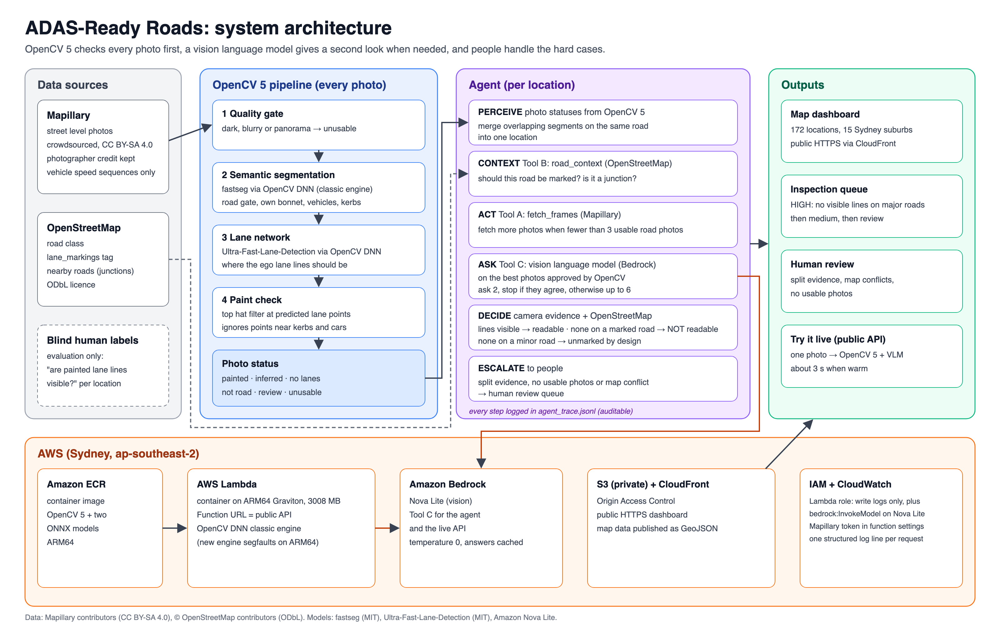

# ADAS-Ready Roads

**Can a camera based lane keeping system see the painted lane lines on this road?**

ADAS-Ready Roads is an agent that screens Sydney streets for lane marking visibility. It uses
crowdsourced street level imagery (Mapillary), **OpenCV 5**, OpenStreetMap context and a vision
language model (VLM) on **Amazon Bedrock**, and it routes uncertain places to people.
It is built for councils that want to know where driver assist cameras may struggle,
without sending out survey vehicles.

> **Research prototype.** Verdicts are screening hints to prioritise human inspection, not
> safety certifications. The evaluation below states what has and has not been demonstrated.

* **Live dashboard:** https://d1dzzj0gvxxl4o.cloudfront.net
* **Live API (AWS Lambda Function URL):** https://unft6yl7d6znbr6gvfvqbwzqmq0tidph.lambda-url.ap-southeast-2.on.aws/
  Opening it in a browser shows how to use it. To analyse a photo, send a POST request, for example:
  `curl -X POST https://unft6yl7d6znbr6gvfvqbwzqmq0tidph.lambda-url.ap-southeast-2.on.aws/ -H 'content-type: application/json' -d '{"mapillary_id": "1043027243798906"}'`
  The easiest way to try it is the "Try it live" box on the dashboard.
* Entry for the OpenCV AI Competition 2026 (powered by AWS).
* **Technical report:** [docs/technical_report.pdf](docs/technical_report.pdf)

---

## Results at a glance

Every location is checked against one question: *are painted lane lines visible?*
Ground truth comes from blind human labels.

| Evaluation | Locations | Lines visible, confirmed | No lines, found |
|---|---|---|---|
| Clean test, 4 unseen suburbs (frozen v5) | 56 | **42 of 48 decided = 88%** (95% CI 75 to 94%) | 0 of 1 (only one such road) |
| Final set, 5 suburbs (reused, disclosed) | 48 | 31 of 38 = 82% | 4 of 7 |
| Development suburbs | 29 | 17 of 19 = 89% | 5 of 8 |
| **Pooled** | 133 | **90 of 105, about 86%** | **9 of 16, about 56% (very uncertain)** |

* About 1 in 10 locations goes to human review instead of being guessed.
* **Detecting missing markings is not yet demonstrated.** Roads without lines are rare in
  crowdsourced imagery (16 of 133 labelled locations).
* Earlier versions that used OpenCV alone (a hand built paint detector, then a lane network with
  a paint check) scored **at chance** on unseen suburbs: 44% with kappa −0.01 on the 48 location
  set, where v5 reaches 78% with kappa 0.31.
* OpenStreetMap alone is a poor guide (54% on the 48 location set).
* Human self agreement on **paint wear** was poor (kappa 0.14 over two blind passes), so the
  system does **not** grade wear. It answers the measurable question of visibility instead.

Full numbers, protocol and history: `notes/final_evaluation.md` and the `eval_*.txt` files.

---

## How it works

~~~
Mapillary photos (CC BY-SA)                         OpenStreetMap (ODbL)
        |                                                   |
        v                                                   |
 OpenCV 5 pipeline (every photo)                            |
   quality gate (dark, blurry, panorama)                    |
   fastseg semantic segmentation (OpenCV DNN):              |
     road gate, own bonnet removal, vehicles                |
   Ultra-Fast-Lane-Detection (OpenCV DNN) + paint check     |
        |                                                   |
        v                                                   v
 Agent (per location)  PERCEIVE → CONTEXT → ACT → ASK → DECIDE → ESCALATE
   * vehicle speed filter (drops walking and handheld sequences)
   * merges overlapping segments on the same road into one location
   * ACT: fetches more Mapillary photos when fewer than 3 usable road photos exist
   * ASK: Tool C, Amazon Bedrock (Nova Lite), on the best photos approved by OpenCV,
          adaptively: ask 2, stop if they agree, otherwise up to 6 (about 2.4 per location)
   * DECIDE with OSM: lines visible → readable | no lines on a marked road → NOT readable
                      (HIGH priority on major roads) | no lines on a minor road → unmarked
   * ESCALATE: split evidence, no usable photos or a map conflict → human review
   * every step is logged to *_agent_trace.jsonl; every photo and answer to *_agent_frames.csv
        |
        v
 AWS: Lambda (container, ARM64 Graviton, Sydney) → live single photo API
      S3 (private) + CloudFront (Origin Access Control) → public dashboard
      IAM least privilege: logs only, plus bedrock:InvokeModel on Nova Lite only
~~~

### Why a vision language model?
Three approaches using OpenCV alone were built and honestly tested on unseen suburbs, and all
scored at chance (see History). The evaluation target, "are painted lines visible?", is a human
visual judgement, and a VLM matched blind human labels far better (development probe: 96%,
kappa 0.84 on consistently labelled locations). OpenCV 5 stays the first stage. It rejects
unusable and non road photos and selects the frames the VLM sees, which keeps calls few and cheap.

### OpenCV 5 findings
* **The new OpenCV 5 DNN engine segfaults** on both ONNX models on Linux ARM64 (AWS Lambda),
  reproducibly at `net.forward()`, and crashed intermittently on macOS. The **classic engine**
  (`cv.dnn.readNetFromONNX(path, engine=cv.dnn.ENGINE_CLASSIC)`) is stable. Verdicts from the
  classic and new engines agreed on 318 of 320 photos (`compare_engines.py`).
* The output shape of `HoughLinesP` changed from 4.x; this is handled with `reshape(-1, 4)`.

---

## Repository guide

| File | Purpose |
|---|---|
| `adas_pipeline.py` | OpenCV 5 pipeline per photo, v4 (quality, segmentation, lane network and paint check) |
| `lane_features.py` | Ultra-Fast-Lane-Detection wrapper and paint verification |
| `agent.py` | Location agent v5 (perceive, context, fetch, ask the VLM, decide, escalate, traces) |
| `agent_tools.py` | Tool A `fetch_frames` (Mapillary) and Tool B `road_context` (OSM Overpass, cached) |
| `vlm_tool.py` | Tool C: Amazon Bedrock Nova Lite, "are painted lane lines visible?" (cached) |
| `segments.py` | Vehicle speed filter, segments of about 100 m, summary per segment |
| `run_pipeline.py` | Runs the pipeline over `<data>/<area>/*.jpg` |
| `fetch_mapillary.py` | Downloads images and metadata (including photographer credit) for a bounding box |
| `handler.py`, `Dockerfile` | AWS Lambda endpoint for single photos (OpenCV 5 and Bedrock) |
| `dashboard/` | Static map dashboard (Leaflet), hosted on S3 and CloudFront |
| `view_segments.py`, `label_binary.py`, `label_locations.py` | Contact sheets and blind labelling tools |
| `evaluate_binary.py`, `evaluate_locations.py`, `label_agreement.py`, `remap_labels.py` | Evaluation, label reliability and label mapping |
| `export_seg.py`, `export_ufld.py` | One time ONNX export of the two models |
| `notes/` | Failure analyses and the full evaluation log |

---

## Run it yourself

**1. Setup** (macOS or Linux, Python 3.12 or newer):
~~~bash
python -m venv .venv && source .venv/bin/activate
pip install -r requirements.txt
~~~

**2. Models** (not in git; see licences below):
~~~bash
pip install -r requirements-export.txt
python export_seg.py           # creates models/fastseg_large_512x1024.onnx
# Ultra-Fast-Lane-Detection: clone https://github.com/cfzd/Ultra-Fast-Lane-Detection to ../ufld,
# download culane_18.pth from that README into models/, then:
python export_ufld.py          # creates models/ufld_culane18_288x800.onnx (loaded with weights_only=True)
~~~

**3. Credentials:** a Mapillary token in `MAPILLARY_TOKEN`, and AWS credentials with Bedrock
access (`aws login --region ap-southeast-2`) for the VLM tool.

**4. Fetch photos, analyse them, run the agent:**
~~~bash
python fetch_mapillary.py kensington 151.215 -33.925 151.230 -33.910 data 100
python run_pipeline.py data output_main
python agent.py output_main/results.csv main_
python view_segments.py --prefix main_ all            # annotated contact sheets
~~~
Outputs: `main_segments_agent.csv` and `.geojson`, `main_review_queue.csv`,
`main_agent_trace.jsonl`, `main_agent_frames.csv`.

**5. Deploy** (summary): build the container (`docker build --platform linux/arm64 --provenance=false
--sbom=false`) and push it to ECR. Create a Lambda (ARM64, 3008 MB, 60 s) from the image, with a
role that has `AWSLambdaBasicExecutionRole` plus `bedrock:InvokeModel` on Nova Lite only. Add a
Function URL with both `lambda:InvokeFunctionUrl` and `lambda:InvokeFunction`
(`--invoked-via-function-url`). Host `dashboard/` in a private S3 bucket behind CloudFront with
Origin Access Control.

---

## History: what was tried, and what the tests said

| Version | Idea | Honest result |
|---|---|---|
| v0 to v3c | Hand built OpenCV paint detector (top hat, Hough, contrast) with segmentation | Overfit the development data; locked test had 7 of 17 dangerous misses; location test on fresh suburbs 42% |
| v4 | Ultra-Fast-Lane-Detection (OpenCV DNN) with paint verification | Final test 44%, kappa −0.01 (chance) |
| v5 | VLM tool on Bedrock gated by OpenCV, adaptive evidence, OSM | Clean test: 88% of lined locations confirmed; missing markings unproven |

Protocol: thresholds were tuned on development data only; each test set was used once (reuse is
disclosed); labels were blind; contact sheets were generated from the exact run being evaluated;
label reliability was measured with a second blind pass.

---

## Limitations and responsible use
* Screening only. Never a substitute for an on site inspection or a safety assessment.
* Detection of missing markings is not yet validated (too few unmarked roads in the data).
* Labels come from a single labeller, and wear cannot be judged reliably from crowd photos.
* Crowd imagery is uneven in time, camera, weather and coverage; results reflect when photos were taken.
* OpenStreetMap lookups can fail under server load (disclosed for each evaluation).
* Photographer credit and licence are kept with every photo; no images are stored in the repository.

## Credits and licences
* Street imagery: Mapillary contributors, CC BY-SA 4.0 (creator recorded for each photo).
* Road data and map tiles: © OpenStreetMap contributors, ODbL.
* fastseg MobileV3Large (MIT), weights trained on Cityscapes.
* Ultra-Fast-Lane-Detection, Qin et al., ECCV 2020 (MIT), weights trained on CULane.
* Amazon Nova Lite via Amazon Bedrock.
* Built with OpenCV 5, AWS Lambda, ECR, S3, CloudFront, IAM and Bedrock.

Author: Anna Rose Bijoy, Master of IT (AI), UNSW Sydney.
